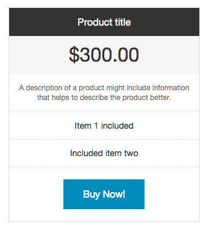

### Rubysteps 21 Day Challenge (2015-06 003)

#### Day 09
Today I went through half the content of [Learning Zurb Foundation](http://www.infiniteskills.com/training/learning-zurb-foundation.html) by John Ulliman. It was exhausting but ultimately fascinating.

A couple of things that stood out to me:

1. The reverse inheritance model used for the whole framework. What I mean is, instead of designing the page from the desktop down to mobile, you actually start with mobile first. Everything you do at that level is then inherited upwards until you reach an xxlarge (which should work with big screens). The main sizes for the grid are small, medium, large, xlarge and xxlarge. A caveat though, I'm not quite sure though if xlarge and xxlarge [are still available by default without using a config setting](http://stackoverflow.com/questions/21620140/foundation-5-no-longer-using-xlarge-and-xxlarge-grid-sizes).

2. I particularly liked the construction of pricing tables with the framework. Look at the code below to see how easy it is to build something like this:



Before:
```html
<div class="medium-4 columns">
  <h2>h2 heading</h2>
    <ul>
     <li>Product title</li>
     <li>$300.00</li>
     <li>A description of a product might include information that helps to describe the product better.</li>
     <li>Item 1 included</li>
     <li>Included item two</li>
     <li><a class="button" href="#">Buy Now!</a></li>
  </ul>
</div>
```

After:
```html
<div class="medium-4 columns">
  <h2>h2 heading</h2>
    <ul class="pricing-table">
     <li class='title'>Product title</li>
     <li class='price'>$300.00</li>
     <li class='description'>A description of a product might include information that helps to describe the product better.</li>
     <li class='bullet-item'>Item 1 included</li>
     <li class='bullet-item'>Included item two</li>
     <li class='cta-button'><a class="button" href="#">Buy Now!</a></li>
  </ul>
</div>
```

Lastly, I also read a bit on [PageObjects](http://www.cheezyworld.com/2010/11/09/ui-tests-not-brittle/) in preparation for doing the acceptance tests later on. Instead of testing on top of the page's elements, you create a class that represents the page and test on top of that. Designer changed the page's elements? You go into your PageObject and change it there. No hunting down through the tests.
