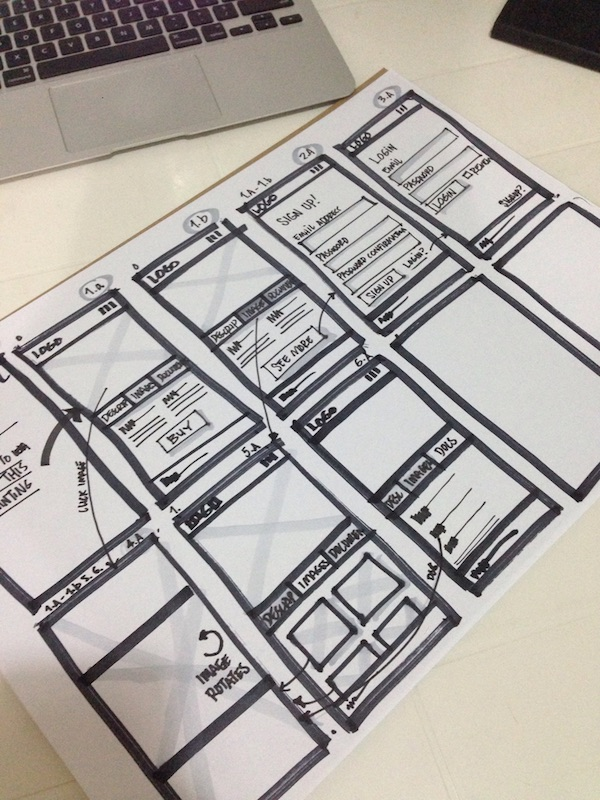

### Rubysteps 21 Day Challenge (2015-06 003)

#### Day 10
Today I worked on a couple of mockups by using some tips gleaned from Foundation posts:

Resources:
- [Storyboarding in the Software Design Process | UX Magazine](http://uxmag.com/articles/storyboarding-in-the-software-design-process)
- [Foundation | Stencils](http://foundation.zurb.com/stencils.html)
- [ZURB U | Using personas to build better user flows](http://zurb.com/university/lessons/using-personas-to-build-better-user-flows)
- [ZURB U | Avoid Highlighter Abuse in Sketches](http://zurb.com/university/lessons/avoid-highlighter-abuse-in-sketches)
- [ZURB U | Autopsy of Failed Sketches Leads to Great Work](http://zurb.com/university/lessons/autopsy-of-failed-sketches-leads-to-great-work)
- [ZURB U | How to Sketch Form Elements](http://zurb.com/university/lessons/how-to-sketch-form-elements)
- [Marvel - Projects](https://marvelapp.com/manage)
- [ZURB U | Keep on the Same Page With a Sketching Language](http://zurb.com/university/lessons/keep-on-the-same-page-with-a-sketching-language)